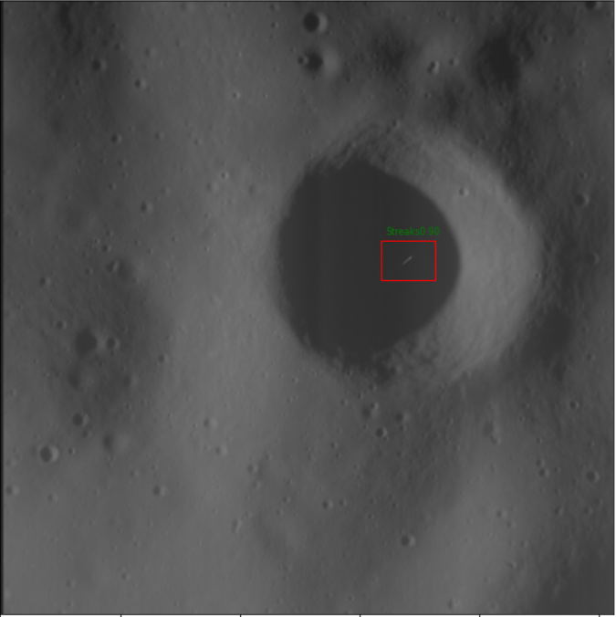

# CRISMIS
This project was made as a part of Google Summer of Code 2020
There are 2 parts of this project:
## Installation
1. Clone this repo
2. Install the following packages:
  1. For tool: 
  * For pytorch 1.6.0, cudatoolkit 10.1 , torchvision   refer : https://pytorch.org/
  ```pip install torch 
     pip install torchvision ```
  
  * planetaryimage 0.5.0 ```pip install planetaryimage```
  * requests 2.7 ```pip install requests==2.7.0```
  * Astropy 4.0 ```pip install astropy```, scipy 1.4 ```pip install scipy```
  * Matplotlib 
  2. For Training:
  
3. To use the tool, download the 2 pre-trained models ```rpn_99.pth``` and ```classifier_final.pth``` and place it in the main directory of this repo. The link to the models is:
* https://drive.google.com/drive/folders/18ciTnhn0-aSIqPd5NrWT6mfCpEI0Nat4?usp=sharing
  
## Usage

### Tool:
1. To use the tool, first follow the Installation steps for the tool
2. Within the main directory, ```cd``` to the  tool directory
3. Type ```python tool.py``` with the required arguments
    *  ```--directory``` name of the directory
    *  ``` --name``` name of the image in directory
4.  A typical example looks like this:
``` cd tool 
    python tool.py --directory 2014_215 --name EN1049375684M.IMG
 ```
 The result looks like this:
 
 
 
This result will be stored in a sub-directory called ```predictions/``` if a cosmic ray is found. If the cosmic ray is not found as in an example below, the following message is displayed: 
``` Cosmic Ray not Found```

Every image tested also gets stored in a directory ```images/``` 
 
 ### Training Script:
 1. In case you want to train the RPN model yourself for a different dataset, you may use the training script provided in the directory ```rpn/```
 2. Go to the rpn subfolder
 3. Type ```python train.py``` with the required arguments
    *  ```--e``` number of epochs to train
    * ``` --model``` Backbone : resnet50 or resnet18 are provided as of now
    * ``` --exp``` Experiment No if you want to perform any experiments
 4.  A typical example for training looks like this:
 ``` cd rpn/
      python train.py --e 10 --model resnet50 --exp 1
 ```
 5. The training script saves the model after every 20 epochs in the directory ```saved_models/exp_no``` where 'exp_no' is the experiment number.
 6. Along with the saved models, 3 graphs are generated corresponding to classification, regression and total losses obtained during training and validation. These graphs are also saved in the directory mentioned above.
 7. For visualization of the trained model, the script ```visualize.py``` is provided, to visually assess the predictions.

## Notebooks
The work has been divided into the following notebooks for easy use:

```scanner.ipynb``` Contains utilities for easy retrieval of data from the MESSENGER archive, a GUI for sorting the images based on visual inspection, and a scanner to scan the  images for cosmic ray artefacts from a list of dates from the archive.

```artefacts_library.ipynb``` Pre-processing of predictions at the rpn stage to help in creation of different classes of data for the classifier stage

```RPN_R50_notebook.ipynb```  The training script contained in the ```rpn/``` folder has been converted into the form of a notebook, for step by step training and visualisation.
